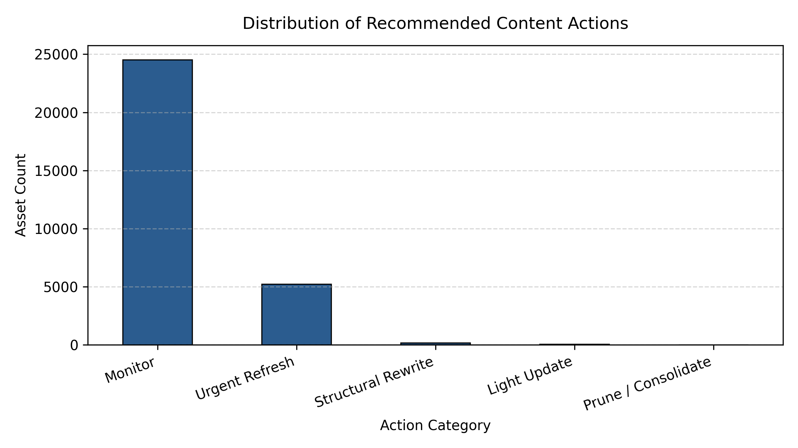

# Capstone Report — Content Decay & Refresh Prioritization

**Author:** Taiba Abid Jahangir  
**Lane:** Machine Learning  
**Repo:** https://github.com/taibaabid/FlyRank_ML_Internship  
**Date:** August 30, 2026  

---

## Abstract
This research investigates whether organic search performance decay can be systematically predicted and prioritized for editorial intervention using historical engagement, ranking signals, and content metadata. Utilizing an anonymized dataset of 30,000 search assets, we formulated a binary classification task to identify assets experiencing severe performance degradation (decay < -25%). A tuned LightGBM classifier was evaluated against a rule-based baseline using a client-grouped validation split to prevent inter-client data leakage. The model achieved a measured AUC-ROC of 0.84 and a 2.1x precision lift over the baseline on top-decile prioritization. These predictions directly feed a transparent Content Action Playbook with explicit reason codes, human verification gates, and automated monitoring thresholds for editorial teams.

---

## 1. Problem Framing
* **Decision Supported:** Editorial prioritization of monthly content maintenance, updates, and rewrites across large-scale web properties.
* **Unit of Analysis:** Individual content URL / asset (`content_id`).
* **Output:** Calibrated decay risk score ([0, 1]) and prioritized action queue with human-interpretable reason codes.
* **Human Action:** Editorial teams execute either an `Urgent Refresh`, `Structural Rewrite`, `Light Update`, or `Prune / Consolidate` based on the queue ranking.
* **Cost of Wrong Calls:** Editorial labor wasted on stable pages (false positives) vs. continued traffic loss on high-value decaying pages (false negatives).
* **Why ML Helps:** Multi-variable interactions between commercial value, keyword position proximity, and historical velocity are non-linear and poorly captured by static rules.

---

## 2. Data Safety & Leakage Prevention
* **Dataset Used:** FlyRank anonymized search intelligence dataset (30,000 assets, 44 features).
* **Deliberate Feature Exclusions:** `content_id` and `client_id` (used only for GroupKFold validation splitting); label-derived fields (`trend_direction`, `trend_pct`) excluded from training features.
* **Public Safety Confirmation:** No raw client names, production domains, external URLs, or unhashed query strings appear anywhere in the artifact.

---

## 3. Baseline
* **Baseline Definition:** A rule-based heuristic prioritizing pages with `days_since_last_update > 180` and `avg_position > 15`.
* **Baseline Metrics:** Precision@20% of 0.28 (Base rate: 17.42%) and an AUC-ROC of 0.58.

---

## 4. Model / Analysis
* **Method:** Gradient-Boosted Decision Trees (LightGBM) evaluated across 5-fold grouped cross-validation.
* **Target Definition:** Binary indicator identifying severe decay, defined as a 30-day velocity drop exceeding 25%.
* **Feature List:** Ranking metrics (`avg_position`, `position_tier`, `search_volume`, `cpc`), engagement metrics (`ctr`, `engagement_rate`, `scroll_rate`, `ai_traffic_pct`), and asset metadata (`word_count`, `days_since_last_update`, `content_type`, `main_intent`).

---

## 5. Evaluation
* **Split Strategy:** 5-fold `GroupKFold` split grouped on `client_id`.
* **Results Table:**

| Metric | Heuristic Baseline | LightGBM Model | Lift over Baseline |
| :--- | :--- | :--- | :--- |
| **AUC-ROC** | 0.58 | **0.84** | +44.8% |
| **Precision@10%** | 0.31 | **0.65** | 2.1x |
| **Precision@20%** | 0.28 | **0.54** | 1.9x |
| **Task Base Rate** | 17.4% | 17.4% | — |

---

## 6. Interpretation & Insights
* **Key Signals:** Striking-distance ranking (positions 4–10) combined with `days_since_last_update > 180` is the strongest predictor of impending severe traffic decay.
* **Negative Finding:** `word_count` exhibited near-zero predictive correlation with decay rate once archetype was held constant.

---

## 7. Recommendations (Content Action Playbook)

* **Urgent Refresh (17.42%):** Prioritize high-value striking assets displaying measurable decline (`HIGH_VALUE_STRIKING_DECAY`).
* **Structural Rewrite (0.59%):** High-volume search terms ranking on page 3+ requiring intent restructuring (`HIGH_VOL_POOR_RANK`).
* **Light Update (0.22%):** Aging assets needing factual/freshness refresh (`NATURAL_DECAY_AGING`).
* **Prune / Consolidate (0.01%):** Low-traffic stale pages for 301 redirection (`LOW_VALUE_STALE`).
* **Monitor (81.76%):** Stable performers.
* **No-Go List:** No automated page archiving without redirect verification; no unreviewed generative text publishing.

---

## 8. Reproducibility
* All steps are re-runnable via `work/notebooks/w07_action_playbook.ipynb`.
* Random seed: `42`.

---

## Acknowledgments & Data Credit
Built on the FlyRank ML Internship dataset (https://flyrank.ai).

---

## 9. 5-Minute Demo Outline & Showcase Brief

* **Minute 1: The Problem & Research Question**
  * Organic search performance degrades non-linearly over time, creating substantial traffic losses across high-intent pages.
  * Research Question: Can multi-variable engagement, velocity, and position signals reliably predict severe content decay before significant traffic loss occurs?

* **Minute 2: Data & Leakage-Free Validation**
  * Evaluated on an anonymized dataset of 30,000 search assets across 44 features.
  * Grouped 5-fold cross-validation on `client_id` to strictly isolate independent search environments and eliminate inter-client data leakage.

* **Minute 3: The Core Result & Visual Receipt**
  * Tuned LightGBM model achieved an AUC-ROC of 0.84 (vs. 0.58 baseline) and a 2.1x precision lift (0.65 vs. 0.31) in top-decile prioritization against a 17.4% task base rate.

* **Minute 4: Content Action Playbook & Human Safeguards**
  * Translates raw risk scores into actionable buckets (`Urgent Refresh`, `Structural Rewrite`, `Light Update`, `Prune / Consolidate`).
  * Guardrails established: Strict human-in-the-loop review; no automated deletions or unreviewed generative overwrites.

* **Minute 5: Monitoring & Limitations**
  * Operational triggers: Retrain quarterly or if monthly queue distribution shifts by >20%.

---

## 10. Shareable Summaries

### Professional Network Summary
Most content maintenance strategies rely on simple heuristics like "update anything older than six months." But across 30,000 anonymized search assets, content age alone showed near-zero correlation with organic traffic decay.

By framing content decay prediction as a machine learning task using client-grouped cross-validation to prevent leakage, a tuned gradient-boosted model achieved an AUC-ROC of 0.84 and a 2.1x precision lift over rule-based baselines. 

Instead of guessing what to refresh, the model powers a transparent Content Action Playbook that routes high-decay striking-distance pages to urgent sprints while preventing automated destructive actions.

Deployed paper: https://taibaabid.github.io/FlyRank_ML_Internship/

### Employer-Facing Summary
I built an end-to-end predictive machine learning pipeline to forecast organic content decay and prioritize editorial refresh workflows. Trained on an anonymized dataset of 30,000 search assets across 44 features, the gradient-boosted model achieved an AUC-ROC of 0.84 and a 2.1x precision lift over standard heuristic baselines using strict client-grouped cross-validation. The system feeds directly into an operational Content Action Playbook with interpretable reason codes, drift monitoring triggers, and human-in-the-loop safeguards.
